# Installing NodeJS

Node.js is a JavaScript runtime built on Chrome's V8 JavaScript engine.

## Pre-requisites

- Administrative access on the host machine for software installation.

## Installation Steps (Windows)

1. Dowload the nodeJS installer for the latest stable nodeJS release (14.x.x) from [nodejs.org](https://nodejs.org/en/).

2. Run the installer to open the NodeJS setup wizard.
3. Follow the below steps in the wizard.
   - Click next.
    - 
   - Accept the license agreement and click next.
    - 
   - Choose the installation directory (default is `C:\Program Files\nodejs\`) and click next.
    - 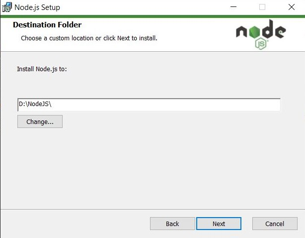
   - Make sure all features are selected and click next.
    - 
   - select the check box to automatically install necessary tools and click next.
    - 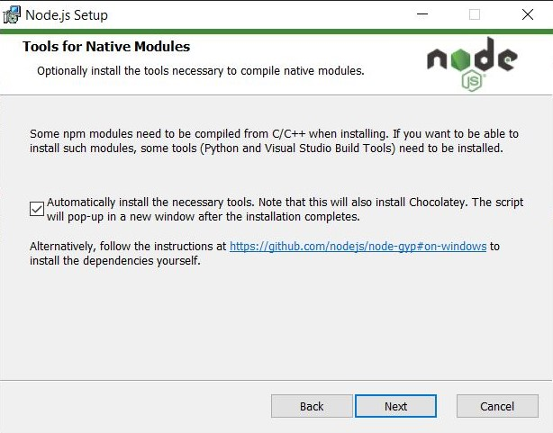
   - Click on install to begin the installation.
    - 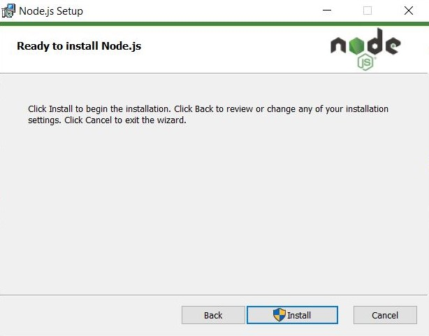
   - Click on YES when prompted by windows to allow this app to make changes to your computer.
4. Upon successful installation, you will see the following message in the wizard

5. Click Finish.
   - This will open a command prompt to install additional dependencies. Press any key to continue.
    - 
   - Click on YES when prompted by windows to allow this app to make changes to your computer.
     - This will begin the installation of dependencies in windows powershell.
      - 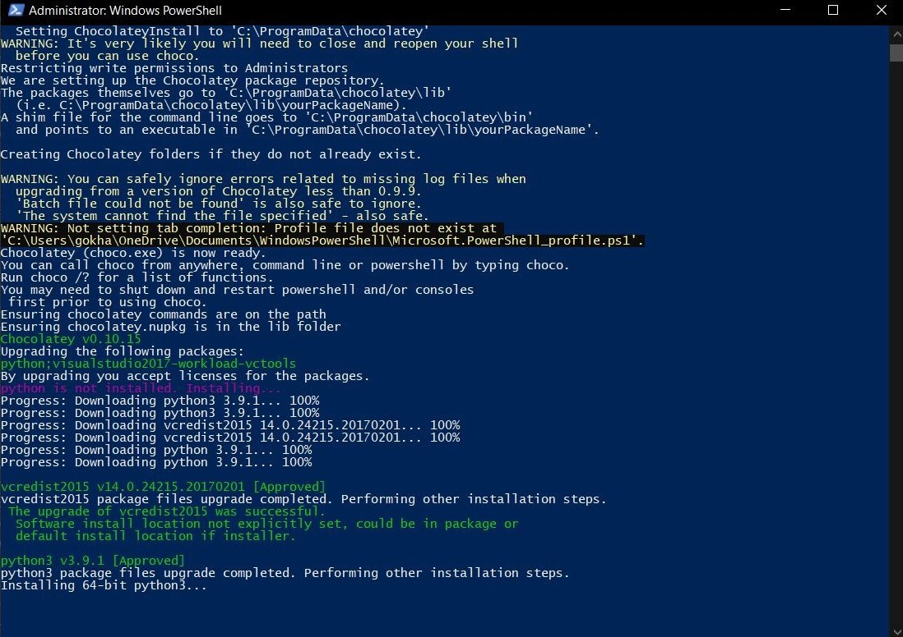
   - press enter when prompted to complete the installation.
6. NodeJS is now installed!

## Installing NodeJS with NVM for Windows

1. Download `nvm-setup.zip` from [nvm-windows](https://github.com/coreybutler/nvm-windows/releases).
   - 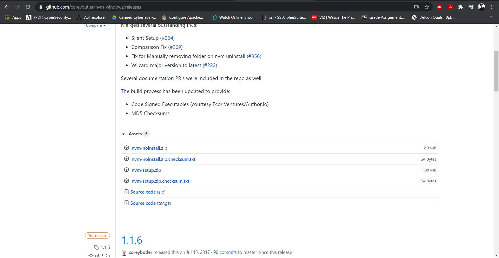
2. Extract the contents of `nvm-setup.zip` and run the executable `nvm-setup.exe`.
   - This should open the nvm installation wizard.
3. Accept the license agreement and click next.
   - 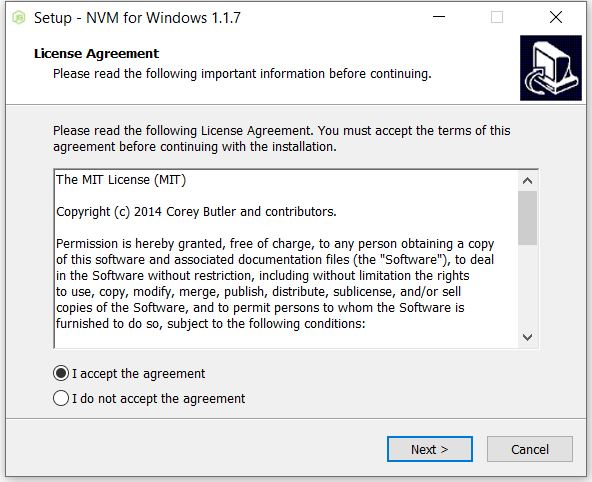
4. Select the destination for installing nvm and click next.
   - 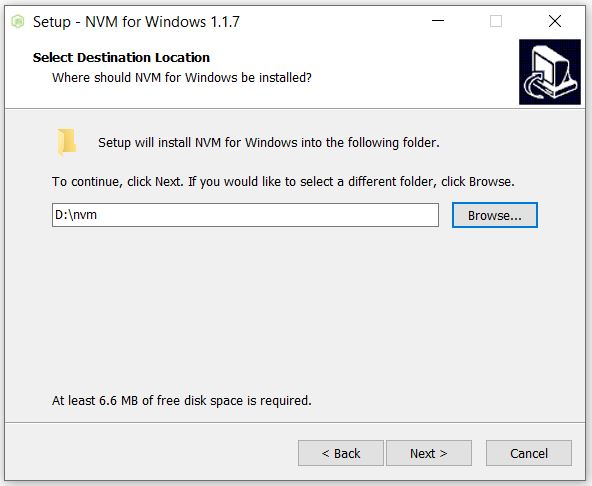
5. Select the destination of NodeJS installation Symlink and click next.
   - 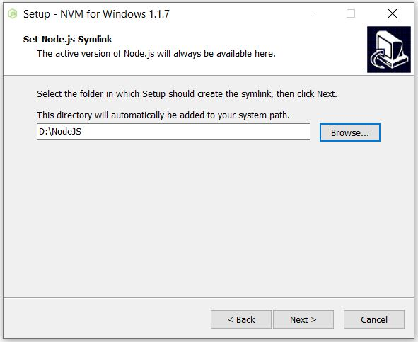
6. Click on install to begin installation.
   - 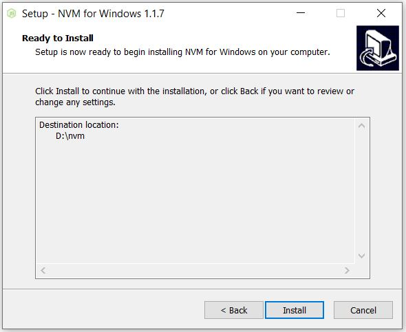
7. Upon completion, you will see the below window
   - 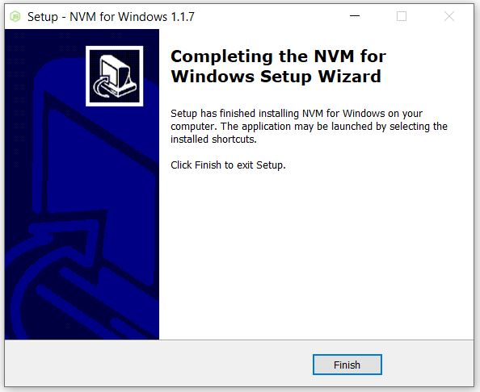
8. Open a command prompt with administrative privileges.
9. Verify the installation, run the command `*nvm version*`
   - This should display the version of nvm installed.
   - 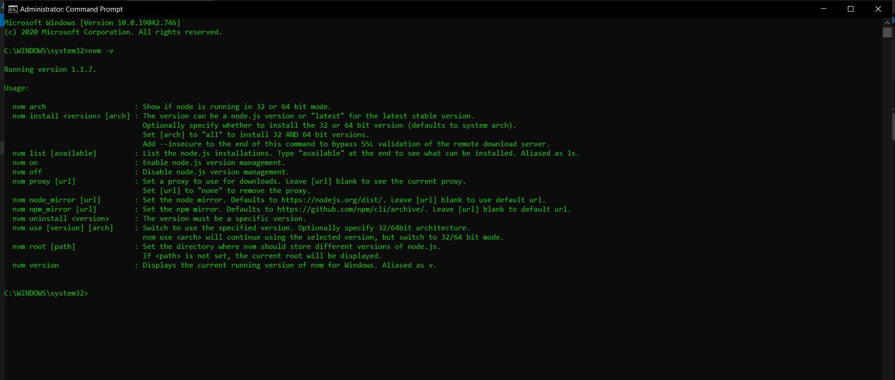
10. Run the command `*nvm list available*` to display all available NodeJS versions.
   - 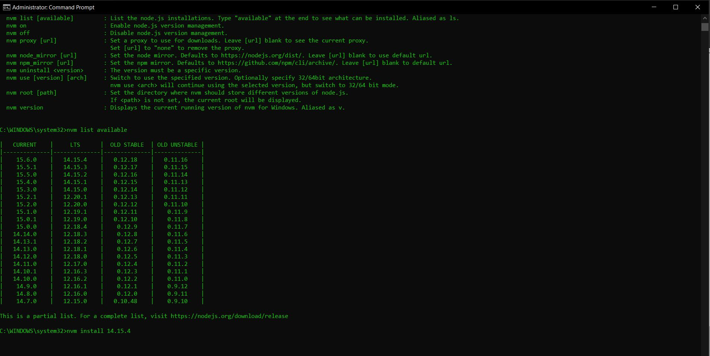
11. Install the latest LTS version of nodeJS available using the command `*nvm install 14.15.4*`.
12. To use this version of NodeJS, run the command `*nvm use 14.15.4*`.
13. Now, NodeJS should be installed and ready for use. To verify the installation run the below commands:
   - `*node -v*`
   - `*npm -v*`
   - 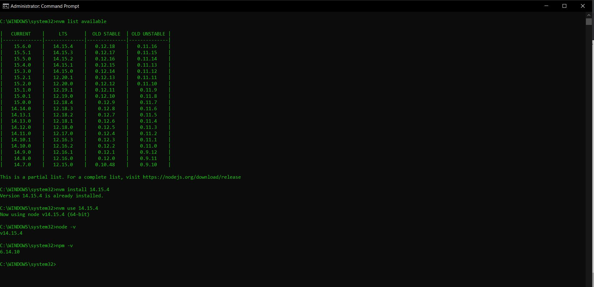
## Installation Steps (Linux / Mac)
- The above steps should also work, but node.js can be installed using the
node version manager (nvm).

1. Run either `curl -o- https://raw.githubusercontent.com/nvm-sh/nvm/v0.37.2/install.sh | bash` or `wget -qO- https://raw.githubusercontent.com/nvm-sh/nvm/v0.37.2/install.sh | bash`.
2. Close and reopen a terminal.
3. Verify nvm is working by entering `command -v nvm`. If your terminal prints
out `nvm`, it should be working. If you see `vm: command not found` or no
feedback, open a new terminal and trying again or restart from step 1.
4. Install node by typing `nvm install 14`.

## Verification

1. Open a shell or windows powershell.
2. Run the command `node -v`
  - This should print the current version of nodeJS installed (v14.x.x)
3. Run the command `npm -v`
  - This should print the current version of npm installed (v6.x.x)

