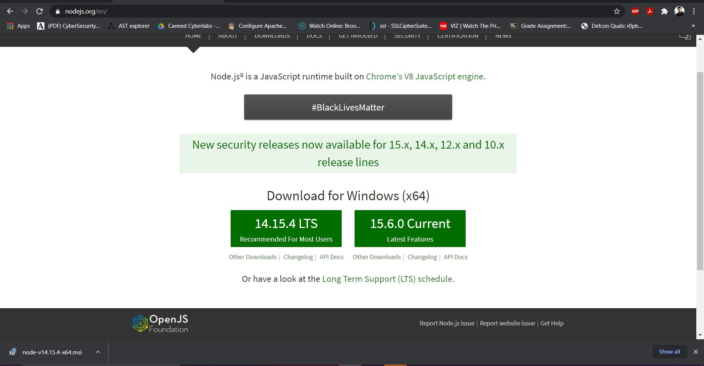
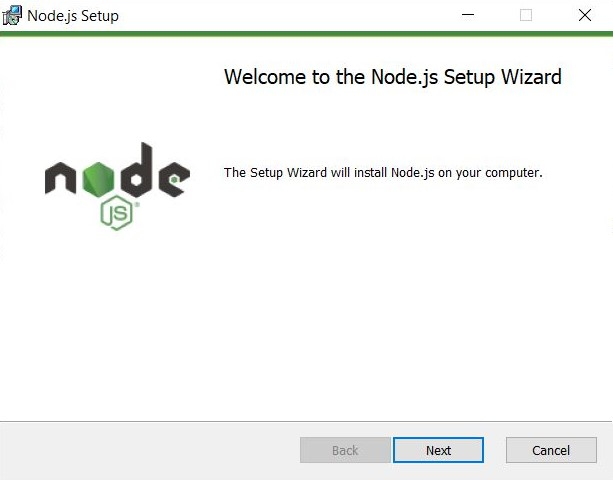
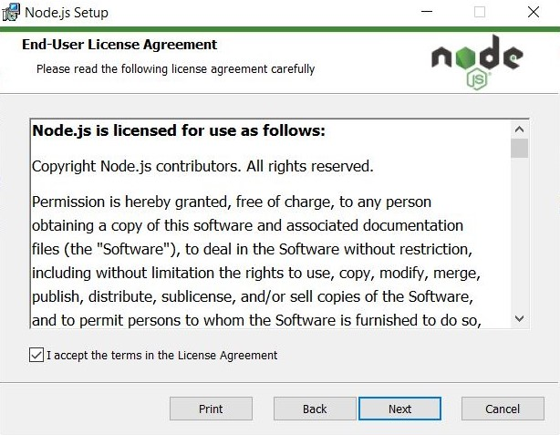
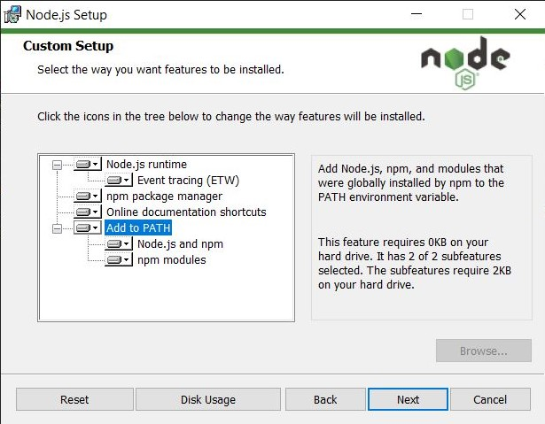
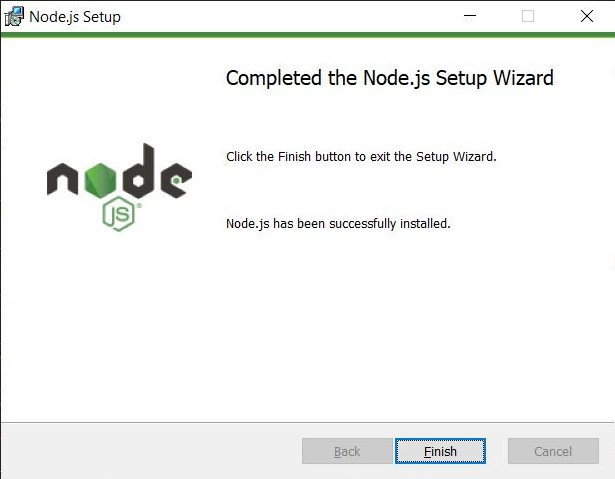
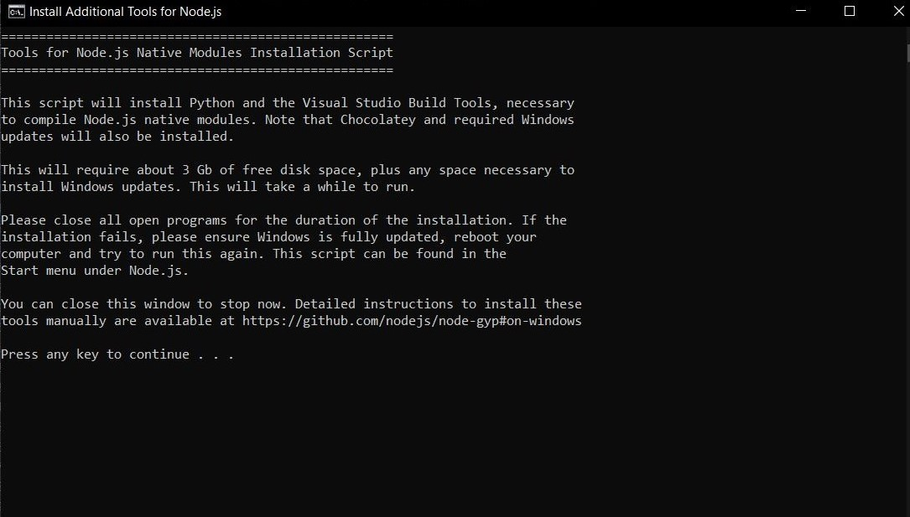

# Installing NodeJS

Node.js is a JavaScript runtime built on Chrome's V8 JavaScript engine.

## Pre-requisites

- Administrative access on the host machine for software installation.

## Installation Steps

1. Dowload the nodeJS installer for the latest stable nodeJS release (14.x.x) from [nodejs.org](https://nodejs.org/en/).

2. Run the installer to open the NodeJS setup wizard.
3. Follow the below steps in the wizard.
   - Click next.
    - 
   - Accept the license agreement and click next.
    - 
   - Choose the installation directory (default is `C:\Program Files\nodejs\`) and click next.
    - 
   - Make sure all features are selected and click next.
    - 
   - select the check box to automatically install necessary tools and click next.
    - 
   - Click on install to begin the installation.
    - 
   - Click on YES when prompted by windows to allow this app to make changes to your computer.
4. Upon successful installation, you will see the following message in the wizard

5. Click Finish.
   - This will open a command prompt to install additional dependencies. Press any key to continue.
    - 
   - Click on YES when prompted by windows to allow this app to make changes to your computer.
     - This will begin the installation of dependencies in windows powershell.
      - 
   - press enter when prompted to complete the installation.
6. NodeJS is now installed!

## Verification

1. Open cmd or windows powershell.
2. Run the command `*node -v*`
  - This should print the current version of nodeJS installed (v14.x.x)
3. Run the command `*npm -v*`
  - This should print the current version of npm installed (v6.x.x)
